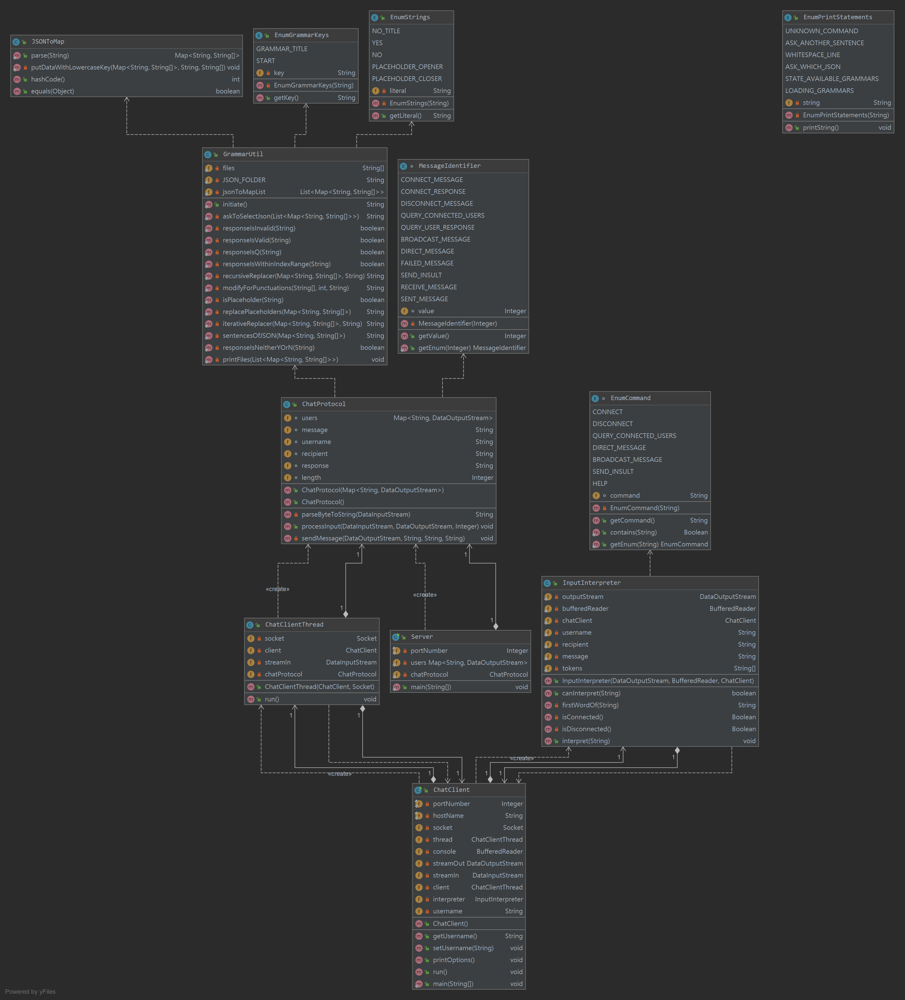

# Build a Chatroom

In this assignment, we built a simple chat room that consists of a server, client, and protocol. The server will be responsible for managing the client connection and activities. Clients will be able to send messages publicly or directly to a specific client. The protocol lays out a set of cases that the server and clients are expected to follow. This assignment also takes in elements from the previous assignments by allowing clients to send randomly generated insult messages to another client in the chat room.

### Entry point to the program

To run the program properly, start the program with the Server class; then, start ChatClient class to add a ChatClient thread to the chat room.

### Key classes/methods

* Server - This class represents a server that is responsible for allowing clients to connect and listening to the activities from the chat client.
* ChatClient - This class represents a chat client to the chat room.
* ChatClientThread - This class is a thread that will take the client input and tells the ChatProtocol to process.
* ChatProtocol - This class represents a protocol that the server and client are expected to follow. It processes the client input following the different MessageIdentifiers.
* MessageIdentifier - This is an enum class that lines out the list of message identifiers for the ChatProtocol.

### Assumptions

* The programs will be started with the Server class first, then the ChatClient class. 
* The files in the grammars folder are all json files. 

### Steps taken to ensure correctness

* Step 1: Make sure the implementation includes a server, chat client, and protocol class, with each being responsible for the tasks laid out in the specifications.
* Step 2: Ensure that the port numbers (Integer portnumber) in Server and ChatClient are set to the same.
* Step 3: When running the program, initiate from the Server class before the ChatClient class.

### UML Diagram

